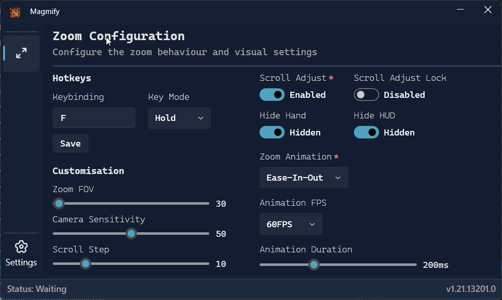
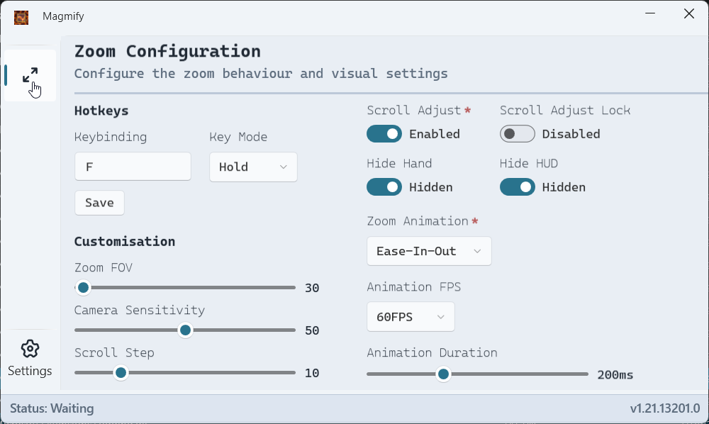

# Magmify

An external Minecraft Bedrock zoom mod.

<p align="center">
  
  
</p>
<p align="center">
  <video controls width="97%">
      <source src="assets/magmify-demo.mp4" type="video/mp4">
  </video>
</p>

## Features

- **Zoom:** Zoom in and out with a configurable keybinding.
- **Hold or Toggle:** Choose between holding the key to zoom or toggling zoom on and off.
- **Adjustable FOV:** Set your preferred zoom level.
- **Adjustable Sensitivity:** Fine-tune your mouse sensitivity while zoomed.
- **Scroll to Adjust:** Use the scroll wheel to adjust the zoom level on the fly.
- **Hide Hand/HUD:** Option to hide your hand and/or the HUD while zoomed.
- **Smooth Animations:** Customizable zoom animations.
- **Multi-language Support:** Supports multiple languages.
- **Theming:** Light and dark themes available.
- **Auto-updates:** Automatically checks for updates on startup.
- **Run on Startup:** Option to run Magmify when your computer starts.
- **Close to Tray:** Option to minimize Magmify to the system tray.

## How to Use

1.  Download the latest release from the [releases page](https://github.com/titushm/Magmify/releases).
2.  Open the `Magmify.exe`.
3.  Configure your desired settings in the Magmify window.
4.  Launch Minecraft Bedrock Edition.
5.  Press your configured zoom key to zoom in.

## Building from Source

### Prerequisites

- [.NET 8 SDK](https://dotnet.microsoft.com/download/dotnet/8.0)
- [Visual Studio 2022](https://visualstudio.microsoft.com/vs/) with the ".NET desktop development" workload.

### Steps

1.  Clone the repository:
    ```sh
    git clone https://github.com/titushm/Magmify.git
    ```
2.  Open the `Magmify.sln` file in Visual Studio.
3.  Build the solution (Ctrl+Shift+B).
4.  The output will be in the `Magmify\Magmify\bin\Release` directory.

## Contributing

Contributions are welcome! If you have a feature request, bug report, or pull request, please open an issue or PR on the [GitHub repository](https://github.com/titushm/Magmify).

## License

This project is licensed under the [MPL2.0 License](LICENSE).
